# 판매툴 — 운영자·사용자 매뉴얼

**대상:** 중매인(로그인 사용자). **관리자 전용** 항목은 별도 표기.

> **삽화:** `images/*.svg` 는 자리표시, **`images/*.png` 는 실제 캡처**입니다. PNG를 추가하면 아래 Markdown에서 해당 파일명으로 `` 로 연결하세요.

---

## 1. 회원가입·로그인·메인 레이아웃

### 1.1 회원가입

📷 **캡처 권장:** 회원가입 화면 전체(이메일 중복확인/인증번호 입력 포함).

<!--  -->

| 항목 | 설명 |
|------|------|
| **상호명, 이메일, 휴대폰번호, 중매인 번호, 비밀번호** | 필수 입력 |
| **이메일 중복확인** | 사용 가능 여부 확인 |
| **인증번호 받기** | 이메일 인증번호 발송 요청(유효시간 5분) |
| **인증번호 확인** | 6자리 코드 검증 후 이메일 인증 완료 |
| **휴대폰 중복확인** | 사용 가능 여부 확인 |
| **중매인 번호 중복확인** | 사용 가능 여부 확인 |
| **개인정보약관 동의** | 미동의 시 회원가입 불가 |
| **회원가입 버튼 활성 조건** | 이메일/휴대폰/중매인 번호 중복확인 완료 + 이메일 인증 완료 + 약관 동의 |

**완료 후:** 로그인 화면으로 이동하며 “회원가입이 완료되었습니다” 안내가 표시됩니다.

### 1.2 로그인·메인 레이아웃

📷 **캡처:** 로그인 후 첫 화면 전체(탭·본문이 보이게).

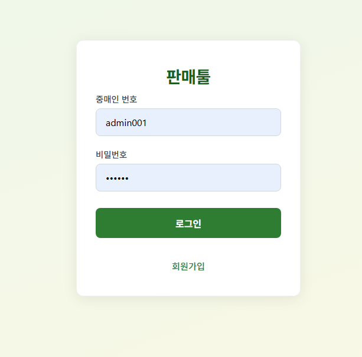

| 영역 | 설명 |
|------|------|
| 헤더 | 서비스명(로고), 우측 **로그아웃** — 세션 종료 후 로그인 화면으로 이동 |
| 탭 | 업무 구분. 클릭 시 해당 화면으로 전환 |
| 본문 | 선택한 탭의 필터·버튼·테이블·모달 |

**관리자:** `상품 마스터` 탭이 추가로 보입니다.

---

## 2. 재고현황 탭

📷 **캡처:** 재고현황 테이블이 보이는 화면.

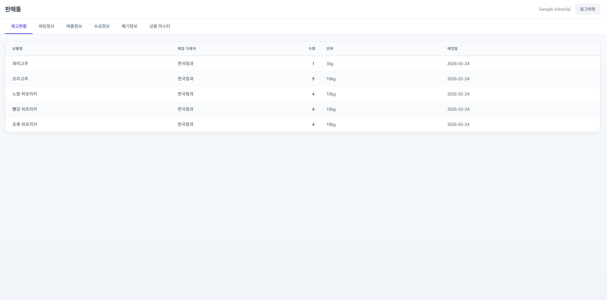

| 요소 | 역할 |
|------|------|
| (필터 없음) | 전체 재고 목록을 불러옴 |
| 테이블 열 | **상품명**, **매입 거래처**(최근 매입 기준), **수량**, **단위**, **매입일**(일자) |

**역할:** 창고형 재고 수량을 상품별로 확인합니다. 매입·매출·폐기 후 갱신된 값이 표시됩니다.

---

## 3. 매입정보 탭

📷 **캡처:** 매입정보 필터 + 목록 + 상단 버튼 영역.

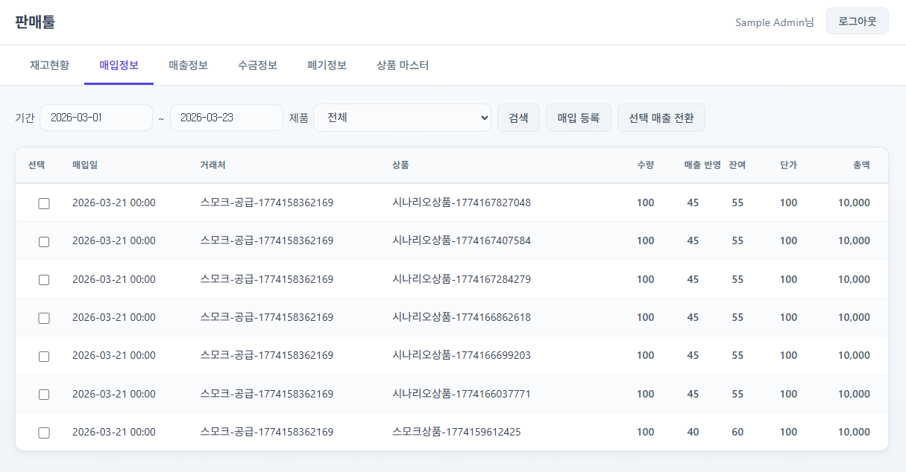

### 3.1 필터·버튼

| 요소 | 역할 |
|------|------|
| **기간** (시작~끝) | `YYYY-MM-DD` 형식. 해당 기간의 매입만 조회 |
| **제품** | 드롭다운 — 특정 상품만 보거나 **전체** |
| **검색** | 위 조건으로 목록 다시 불러오기 |
| **매입 등록** | 매입 입력 모달을 엽니다 |
| **선택 매출 전환** | 목록에서 체크한 매입 행을 **판매(매출)** 로 전환하는 모달을 엽니다 |

### 3.2 매입 등록 모달

📷 **캡처:** 매입 등록 모달 전체.

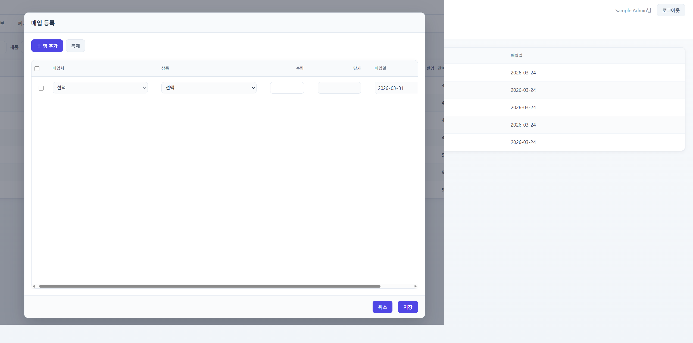

| 요소 | 역할 |
|------|------|
| **＋ 행 추가** | 입력 행을 한 줄 늘림 |
| **복제** | 체크한 행 내용을 복사해 새 행 추가 |
| **체크박스** | 행 선택(복제·전환 등에 사용) |
| **매입처·상품·수량·단가·매입일** | 필수 입력 후 **저장** 시 매입 등록 API 호출 |
| **취소** | 모달 닫기(저장 안 함) |
| **저장** | 입력 완료된 행만 서버에 순서대로 등록 |

### 3.3 선택 매출 전환 모달

📷 **캡처:** 매출 전환 모달.

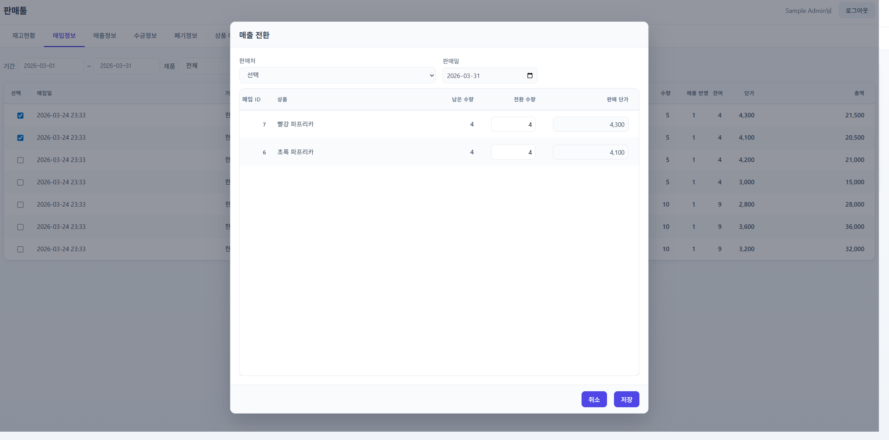

| 요소 | 역할 |
|------|------|
| **판매처** | 매출에 찍힐 거래처 |
| **매출일** | 판매 일자 |
| 표 내 **수량·단가** | 매입 잔량 이내로 매출 생성 |
| **저장** | 선택 매입 → 매출 전환 처리 |

---

## 4. 매출정보 탭

📷 **캡처:** 매출정보 필터 + 목록 + `수금 등록` `환불 처리` 버튼.

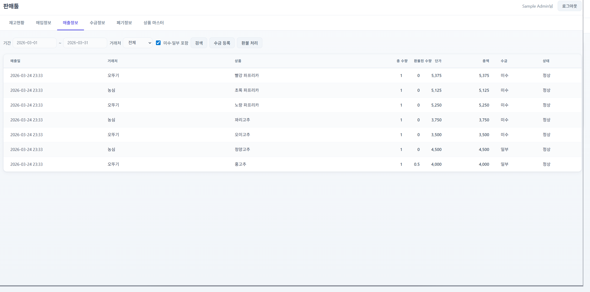

### 4.1 필터·버튼

| 요소 | 역할 |
|------|------|
| **기간** | 매출일 기준 조회 구간 |
| **거래처** | 특정 거래처만 또는 **전체** |
| **미수·일부 포함** | 체크 시 미수·일부 수금 매출도 목록에 포함. 해제 시 기본적으로 수금 완료 위주 표시 |
| **검색** | 조건으로 목록 갱신 |
| **수금 등록** | 미수 매출에 대해 **한 번에 받은 돈**을 여러 매출에 배분하는 모달 |
| **환불 처리** | 수금이 **한 번이라도 발생한** 매출 중 환불 가능 건만 모달에 표시 |

### 4.2 수금 등록 모달

📷 **캡처:** 수금 등록 모달(테이블 포함).

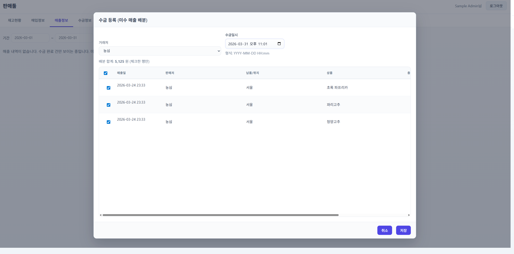

| 요소 | 역할 |
|------|------|
| **거래처** | 수금할 거래처 선택(필수). 해당 거래처 **미수 매출**만 표시 |
| **수금일시** | `YYYY-MM-DD HH:mm` (datetime) |
| 배분 합계 안내 | 체크한 행의 이번 수금 합계와 비교해 검증 |
| **행 체크** | 이번 수금에 넣을 매출만 선택 |
| **매출일** | 일시 전체가 보이도록 표시(가로 스크롤 없음) |
| **판매처·납품/위치·상품·금액·미수** | 참고 |
| **이번 수금** | **숫자만**, **최대 9자리**. 체크한 행에만 입력 |
| **저장** | 수금 건 생성 + 선택 매출에 배분 |

### 4.3 환불 처리 모달

📷 **캡처:** 환불 처리 모달(검색창·테이블).

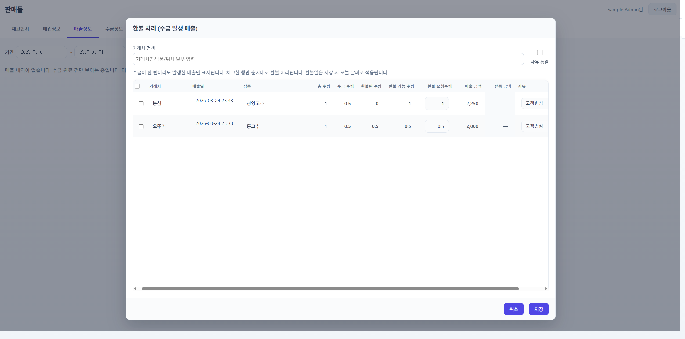

| 요소 | 역할 |
|------|------|
| **거래처 검색** | 거래처명·납품/위치 **부분 검색**(대소문자 무관) |
| **사유 통일** | 체크 시 한 행에서 바꾼 사유가 **현재 필터된 모든 행**에 동일 적용 |
| 안내 문구 | 수금 발생 매출만 표시, 체크한 행만 처리, 환불일은 저장 시 당일 등 |
| **행 체크** | 실제로 환불 API를 호출할 매출 |
| **매출일** | 일시만 표시(매출 수량 보조 문구 없음) |
| **환불 요청수량** | 체크한 행만 입력. 문자열 **최소 3자리**(예: `0.001`, `10.5`) |
| **사유** | **체크와 관계없이** 언제든 선택·직접 입력 가능 |
| **저장** | 체크한 행만 순서대로 환불 처리 |

---

## 5. 수금정보 탭

📷 **캡처:** 수금정보 목록.

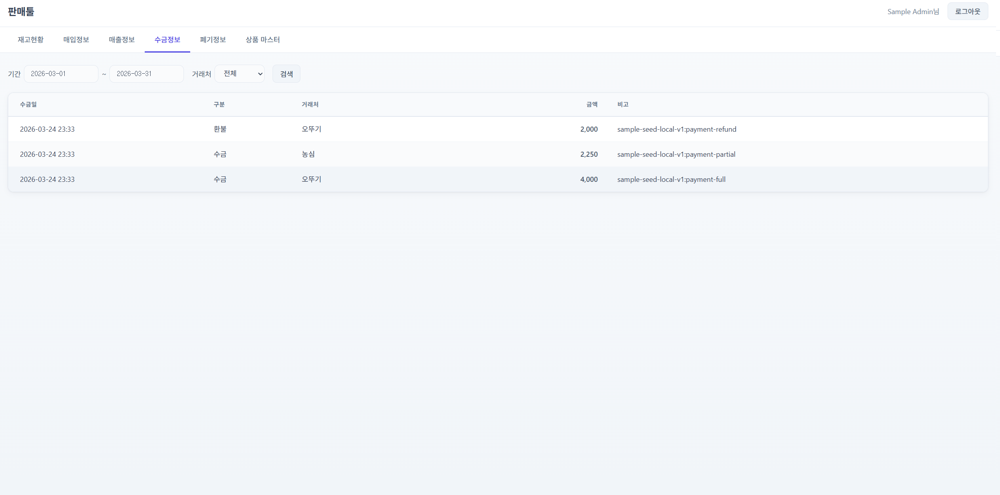

| 요소 | 역할 |
|------|------|
| **기간** | 수금일 기준 |
| **거래처** | 필터 |
| **검색** | 목록 갱신 |
| **구분** | 일반 **수금** / **환불** 등 |
| **금액·비고** | 건별 내역 확인 |

**역할:** 이미 처리된 수금·환불 이력을 조회합니다.

---

## 6. 폐기정보 탭

📷 **캡처:** 폐기정보 기간 필터 + 목록 + `폐기 등록`.

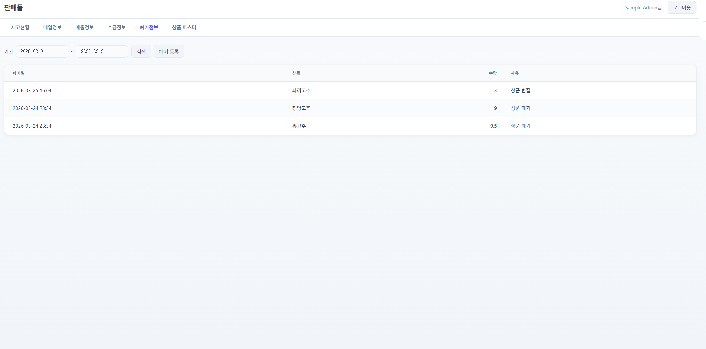

### 6.1 목록 화면

| 요소 | 역할 |
|------|------|
| **기간** | 폐기일 기준 조회 |
| **검색** | 목록 갱신 |
| **폐기 등록** | 재고 기반 폐기 모달 열기 |

### 6.2 폐기 등록 모달

📷 **캡처:** 폐기 등록 모달(검색줄 + 재고 테이블).

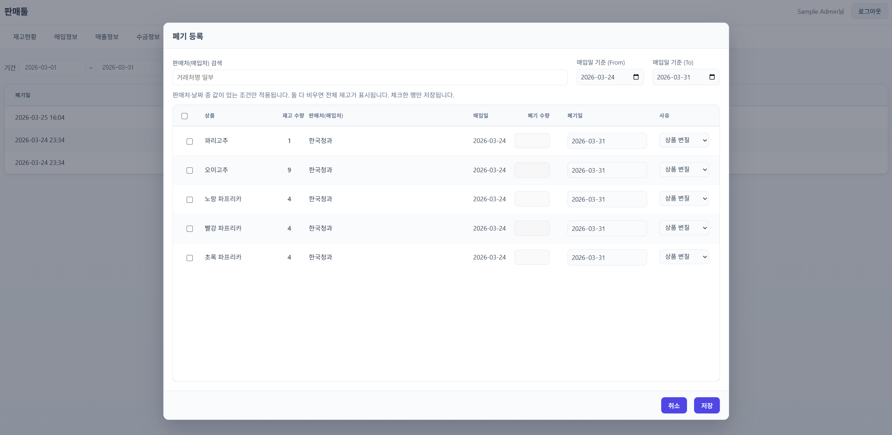

| 요소 | 역할 |
|------|------|
| **판매처(매입처) 검색** | 거래처명 **부분 검색** |
| **매입일 기준 (From/To)** | `YYYY-MM-DD ~ YYYY-MM-DD` 범위 검색. 기본값은 **D-7 ~ 오늘** |
| 안내 | 거래처 검색 + 날짜 범위 조건을 함께 적용(AND). 날짜를 비우면 해당 조건은 제외 |
| 테이블 | 상품·재고·판매처·매입일 |
| **체크** | 폐기 처리할 상품 선택 |
| **폐기 수량·폐기일** | **체크한 행만** 입력 가능 |
| **사유** | 상품 변질 / 상품 폐기 / 직접 입력(하단 텍스트). **체크 없이도** 미리 선택·입력 가능 |
| **저장** | 체크한 행만 서버에 폐기 등록(재고 차감) |

**삭제됨:** 예전의 **복제** 버튼, 행별 상품 콤보·행 추가 방식.

---

## 7. 상품 마스터 탭 (관리자만)

📷 **캡처:** 상품 마스터 목록 + 검색 + 새로 만들기.

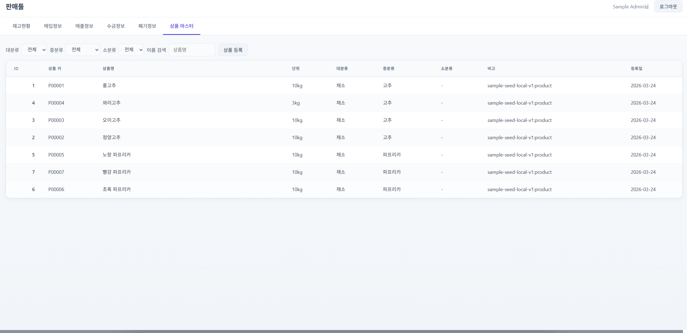

| 요소 | 역할 |
|------|------|
| **대/중/소 분류·상품명** | 검색 조건 |
| **새로 만들기** | 단건/다건 등록 모달 |
| 모달 내 **행 추가·저장** | 마스터 상품 데이터 등록 |

---

## 8. 모달 공통 버튼

| 버튼 | 역할 |
|------|------|
| **취소** | 모달 닫기, 입력 유지 안 함(각 모달 구현에 따름) |
| **저장** / **처리 중…** | 폼 제출. 서버 검증 실패 시 메시지 표시 |

---

## 9. 문의·변경 이력

- 화면 구성 변경 요약: `docs/화면설계/메인-화면-탭-및-모달-변경이력.md`
- 배포 기록: `docs/배포/배포일지/`

---

*본 매뉴얼은 앱 버전에 따라 세부 문구가 달라질 수 있습니다. 불일치 시 이 저장소의 `web/src/pages/Main.jsx` 를 기준으로 수정해 주세요.*
